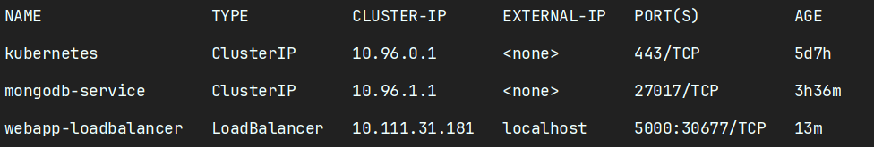

# How to Run Web Application
1. apply database
    ```BASH
    kubectl apply -f k8s\db\mongodb-configmap.yaml
    kubectl apply -f k8s\db\mongodb-secret.yaml
    kubectl apply -f k8s\db\mongodb-storage.yaml
    kubectl apply -f k8s\db\mongodb-deployment.yaml
    kubectl apply -f k8s\db\mongodb-service.yaml
    ```
2. apply backend
   ```BASH
   kubectl apply -f k8s\backend\backend-deployment.yaml
   kubectl apply -f k8s\backend\backend-service.yaml
   ```
3. apply frontend
    ```BASH
    kubectl apply -f k8s\app\configmap-app.yaml
    kubectl apply -f k8s\app\app-loadbalancer.yaml
    kubectl apply -f k8s\app\app-deployment.yaml
    kubectl apply -f k8s\app\app-secret.yaml
    ```
4. check the load balancer
    ```BASH
    kubectl get svc
    ```
   
5. visit via EXTERNAL-IP:5000.

